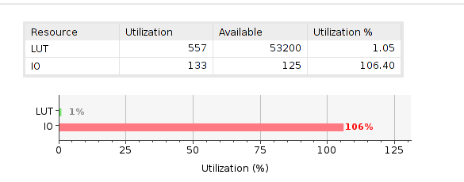
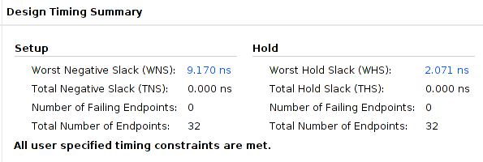

# Practical 1 b) - ALU

## Code

**`Alu.v`  (top module)**

```verilog
`timescale 1ns / 1ps
////////////////////////////////////////////////////////////////////////////////
//
// Description:    Integer ALU for RISC-V core (RV32I version)
//
// This module is expected to implement an RV32I ALU.
// This file initially contains only the module header and a set of opcode
// definitions for each of the 10 ALU operations that are to be implemented.
//
// The ALU operates on two operands using the operator defined by exe_alu_opc_r.
//
// The first operand for ALU_OPC_ADD operations may be either exe_pc_r or
// exe_reg1_r, depending on the value of exe_sel_pc_r:
//   (a). if exe_sel_pc_r is 1, then use exe_pc_r
//   (b). if exe_sel_pc_r is 0, then use exe_reg1_r
//
// The first operand for all other operations is always exe_reg1_r.
//
// The second operand for all operations is always exe_src2_r.
//
// The result of the operation should be returned through the alu_result output.
//
// If you choose to use continuous assignment to define alu_result, then you
// should remove the 'reg' declaration keyword from the output port definition
// of alu_result.
//
// Your ALU instructions can be tested incrementally, in four groups of
// instructions, by setting the following macros in the tb.v testbench file
// to either 1 (to enable) or 0 (to disable).
//
//  a) Logical operations  { AND, OR, XOR  } by setting ENABLE_LOGIC to 1 or 0
//  b) Additive operations { ADD, SUB      } by setting ENABLE_ADD to 1 or 0
//  c) Set operations      { SLT, SLTU     } by setting ENABLE_SET to 1 or 0
//  d) Shift operations    { SLL, SRL, SRA } by setting ENABLE_SHIFTS to 1 or 0
//
////////////////////////////////////////////////////////////////////////////////
 
module alu(
  input       [3:0]     exe_alu_opc_r,  // ALU opcode (see lines 21:30 below)
  input                 exe_sel_pc_r,   // Choose between PC (1) or reg1 (0)
  input       [31:0]    exe_pc_r,       // PC at the EXE stage
  input       [31:0]    exe_reg1_r,     // reg1 at the EXE stage
  input       [31:0]    exe_src2_r,     // Second source operand at EXE
  output  reg [31:0]    alu_result      // ALU result output
);
/* Wires for making the results more readable 
Defines the results of operation required by the ALU
Assigns the appropirate one according to switch case
*/
wire [31:0] and_result; 
wire [31:0] or_result; 
wire [31:0] xor_result; 
wire [31:0] add_result; 
wire [31:0] sub_result; 
wire [31:0] logical_result_R; 
wire [31:0] logical_result_L;
wire [31:0] shift_arithematic_result_R;
wire is_logical;
wire is_less_than_result;
wire  is_less_than_result_unsigned;
wire [31:0] sub_B;

assign sub_B = ~exe_src2_r+1; // calculates the 2s compilment negative

// module instantisation of arithmetic shift operator
alu_arith_shift_right u_alu_l_r( .A(exe_reg1_r),.x(exe_src2_r), .result (shift_arithematic_result_R));

/* assigns the value for operations:  
1) and
2) or 
3) xor 
4) logical shifters 
5) less than unsigned 
respectively
*/
assign and_result=exe_reg1_r & exe_src2_r;
assign or_result=exe_reg1_r | exe_src2_r;
assign xor_result=exe_reg1_r ^ exe_src2_r;

assign logical_result_L=exe_reg1_r <<exe_src2_r[4:0];
assign logical_result_R=exe_reg1_r >> exe_src2_r[4:0];
assign is_less_than_result_unsigned =(exe_reg1_r<exe_src2_r);

// module instantisation for signed comparison
signed_compared u_com(.A(exe_reg1_r),.B(exe_src2_r),.result(is_less_than_result));

// module instantisation for addition
alu_adder add_u(.A1(exe_pc_r),.A2(exe_reg1_r),.B(exe_src2_r),.sel(exe_sel_pc_r),.result(add_result));
// module instantisation for subtraction using the same module as addition
alu_adder sub_u(.A1(exe_pc_r),.A2(exe_reg1_r),.B(sub_B),.sel(1'b0),.result(sub_result));

localparam [3:0]  ALU_OPC_AND  = 4'b0111, // bitwise AND
                  ALU_OPC_OR   = 4'b0110, // bitwise OR
                  ALU_OPC_XOR  = 4'b0100, // bitwise XOR
                  ALU_OPC_ADD  = 4'b0000, // 2's complement addition
                  ALU_OPC_SUB  = 4'b1000, // 2's complement subtraction
                  ALU_OPC_SLT  = 4'b0010, // set if less than (signed)
                  ALU_OPC_SLTU = 4'b0011, // set if less than (unsigned)
                  ALU_OPC_SLL  = 4'b0001, // shift-left logical
                  ALU_OPC_SRL  = 4'b0101, // shift-right logical
                  ALU_OPC_SRA  = 4'b1101; // shift-right arithmetic


// combinatoric logic for assigning the result according to the operation
// matches through a switch statement
always @*
 begin
 case(exe_alu_opc_r)
  ALU_OPC_AND : alu_result = and_result;
  ALU_OPC_OR : alu_result = or_result;
  ALU_OPC_XOR : alu_result = xor_result;
  ALU_OPC_SRL  : alu_result = logical_result_R;
  ALU_OPC_SLL  : alu_result = logical_result_L;
  ALU_OPC_SRA  : alu_result = shift_arithematic_result_R;
  ALU_OPC_SLT : alu_result=is_less_than_result;
  ALU_OPC_SLTU : alu_result=is_less_than_result_unsigned;
  ALU_OPC_ADD : alu_result = add_result;
  ALU_OPC_SUB : alu_result = sub_result;
  default : alu_result = 0;
 endcase
 
 end 

endmodule

```

### Sub modules used in the top module

**Addition/Subtraction module (`alu_adder.v`)** 

```verilog
`timescale 1ns / 1ps
//////////////////////////////////////////////////////////////////////////////////
// Company: 
// Engineer: 
// 
// Create Date: 06.10.2021 01:48:52
// Design Name: 
// Module Name: alu_adder
// Project Name: 
// Target Devices: 
// Tool Versions: 
// Description: Addition and subtraction operation module
// additionally also used to compute the register address with offset 
// depending on the operand 
// Dependencies: 
// 
// Revision:
// Revision 0.01 - File Created
// Additional Comments:
// 
//////////////////////////////////////////////////////////////////////////////////


module alu_adder(
    input [31:0] A1,
    input [31:0] A2,
    input [31:0] B,
    input sel,
    output reg [31:0] result
    );
    // reg value to help with selecting the first operand
    reg [31:0] A;
    always @*
    begin
     // sets to 0 to avoid inferred latches
     A = 0;
     /* Selects the second operand 
     this is from whether it is calculating the address or 
     doing normal addition operation
     */
     if(sel)
      begin
       A = A1;
      end
      else
       begin
        A = A2;
       end
      // calculates the result 
      result = A+B;
    end
   
endmodule
```

**Signed comparison module**

```verilog
`timescale 1ns / 1ps
//////////////////////////////////////////////////////////////////////////////////
// Company: 
// Engineer: 
// 
// Create Date: 10/25/2021 04:09:39 PM
// Design Name: 
// Module Name: signed_compared
// Project Name: 
// Target Devices: 
// Tool Versions: 
// Description: Signed comparison of two operators
// 
// Dependencies: 
//  
// Revision:
// Revision 0.01 - File Created
// Additional Comments:
// 
//////////////////////////////////////////////////////////////////////////////////


module signed_compared(
    input [31:0] A,
    input [31:0] B,
    output reg result
    );
// Combinatoric logic
always @*
    begin
     // checks if the last bit of A is set and B is not
     // equivalent to is A negative and B positive
     if(A[31] && B[31]==0)
      begin
       result = 1;
      end
     // Checks if last bit of B is set and A is not 
     // equivalent to is B negative and A positive
     else if(A[31]==0 && B[31])
      begin
       result =0;
      end
      else 
       // Same sign so just do need to do a comparison 
       result = A<B;
    end
    
endmodule
```


## Synthesising the module

The synthesis went smothly with no errors, we can proceed to check the timing and utilisation reports to see the information about our design. 

### Utilisation report 

#### Summary

The summary section of the utilisation report shows the total number of LUTs used, as well as the the IO pins used, it is indicated below.



Addition comments : 557 LUTs are not as optimised as it can be, reducing the LUTs could be done by optimising the code further, but I would not like to sacrifice the readability of the code for optimisation. 

#### Primitives


### Timing and resource utilisation 

#### Summary 

Looking at the timing report in vivado in the Design timing summary we see that:

 

This shows that there is no inferred latches nor any combinational loops. The WNS and WHS are from the `timing.xdc` being at the period `20`, we shall further reduce it as we go on to see, if we can run the code at lower Clock period.

### 


